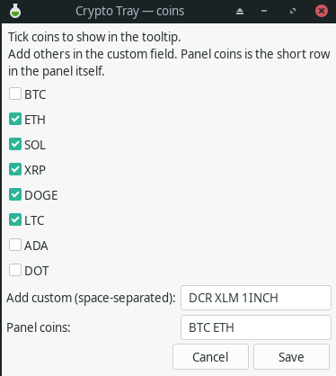
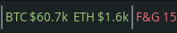
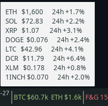

# xfce-convertible-scripts

Small utility scripts for running a convertible / 2-in-1 laptop comfortably
under **XFCE on X11** — pen annotation, a crypto panel readout, and modem
FCC-unlock. Built and tested on a **Fujitsu LIFEBOOK U9313X** running
**Manjaro XFCE**, but most of it is generic to any X11 + XFCE setup.

## Quick start

```bash
git clone https://github.com/pastelrx/xfce-convertible-scripts.git
cd xfce-convertible-scripts
./install.sh
```

The installer shows a numbered menu, checks dependencies (offering to install
missing ones via pacman), copies each chosen script into place, and prints the
manual follow-up steps (like adding a panel monitor or binding a hotkey).

If `./install.sh` gives a "permission denied" (the execute bit didn't survive,
which can happen with web uploads), either run it through bash:

```bash
bash install.sh
```

or restore the execute bits once:

```bash
chmod +x install.sh scripts/*/*.sh
./install.sh
```

<details>
<summary>One-liner install (less safe — runs a remote script directly)</summary>

If you'd rather not clone first, you can pipe the installer straight from
GitHub. Only do this if you trust the source; piping remote code into a shell
means you're running it sight-unseen.

```bash
bash <(curl -fsSL https://raw.githubusercontent.com/pastelrx/xfce-convertible-scripts/main/install.sh)
```

Note: the one-liner still needs the repo's `scripts/` directory next to it, so
cloning is the supported path. The clone-first method above is recommended.
</details>

## Screenshots

The crypto coin-picker GUI:



The panel — crypto ticker and Fear & Greed index:



Hover for the full watchlist with 24h changes:



## What's included

| Script | What it does |
|--------|--------------|
| `gromit-toggle.sh` | Smart launcher/toggle for [Gromit-MPX](https://github.com/bk138/gromit-mpx) screen annotation — first press launches, repeats toggle drawing, no duplicate instances. |
| `gromit-mpx.cfg.example` | Gromit-MPX config: cyan pen by default (readable on dark), eraser on the pen's side button. |
| `crypto-tray.sh` | Live crypto prices in the panel via genmon. Configurable coins; panel shows label+price, tooltip shows a wider watchlist with 24h %. Binance. |
| `crypto-config.sh` | Small [yad](https://github.com/v1cont/yad) GUI to pick which coins `crypto-tray.sh` shows — checkboxes for common coins plus a field for any others. Writes `~/.config/crypto-tray.conf`. |
| `fng-tray.sh` | Fear & Greed index in the panel, coloured by zone. Caches hourly so it paints right after login. alternative.me. |
| `fcc-unlock-setup.sh` | Detects a WWAN modem and activates the matching vendor FCC-unlock script that ships with ModemManager, so it's unlocked automatically. Run with sudo. |

## Requirements

The installer checks these per-script and offers to install what's missing:

- X11 + XFCE
- `gromit-mpx` (AUR) — for the annotation scripts
- `xorg-xinput` — for checking pen button numbers
- `xfce4-genmon-plugin` + `curl` — for the crypto / Fear & Greed panel monitors
- `yad` — for the `crypto-config` coin-picker GUI
- `modemmanager` + `usbutils` — for `fcc-unlock-setup.sh`

## Manual install

If you'd rather not use `install.sh`, copy what you want by hand:

```bash
# panel monitors and the gromit launcher go on PATH
cp scripts/tricker-fng/crypto-tray.sh   ~/.local/bin/
cp scripts/tricker-fng/fng-tray.sh      ~/.local/bin/
cp scripts/gromit-toggle/gromit-toggle.sh ~/.local/bin/
chmod +x ~/.local/bin/{crypto-tray,fng-tray,gromit-toggle}.sh

# gromit config
cp scripts/gromit-toggle/gromit-mpx.cfg.example ~/.config/gromit-mpx.cfg

# fcc-unlock is a one-shot, run in place:
sudo scripts/fcc-unlock/fcc-unlock-setup.sh --dry-run
```

For the panel monitors, add a **Generic Monitor** to the XFCE panel
(`xfce4-genmon-plugin`) pointing at the script, period `60` for crypto and
`300` for Fear & Greed (it caches hourly, so a short period just makes it paint
soon after login). A panel separator between them keeps things tidy.

## Configuring which coins show

`crypto-tray.sh` reads its coin lists from `~/.config/crypto-tray.conf`:

```bash
PANEL_COINS="BTC ETH"
TOOLTIP_COINS="BTC ETH SOL XRP DOGE LTC"
```

You can edit that by hand, or use the **`crypto-config.sh`** GUI: it shows
checkboxes for common coins plus a free-text field for anything else, and a
field for the short panel row. Launch it from rofi, a keyboard shortcut, or a
terminal — whatever's handy (genmon on some versions has no "command on click",
so a rofi/hotkey launch is the reliable route). On Save it rewrites the conf and
restarts the panel so the change shows immediately.

## Data sources & attribution

- **Crypto prices** come from the Binance public API (no key). Binance doesn't
  require attribution; just mind the rate limits — the 60s refresh is well
  within them.
- **Fear & Greed index** comes from
  [alternative.me](https://alternative.me/crypto/fear-and-greed-index/), which
  asks that their data be shown with attribution next to it. `fng-tray.sh` puts
  "Data from alternative.me" in the panel tooltip — keep it if you redistribute.

## License

MIT — see [LICENSE](LICENSE).
